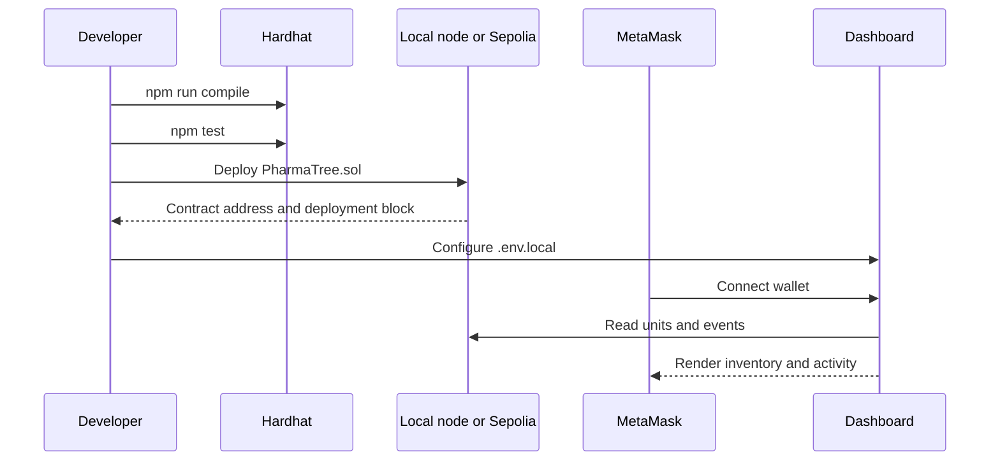
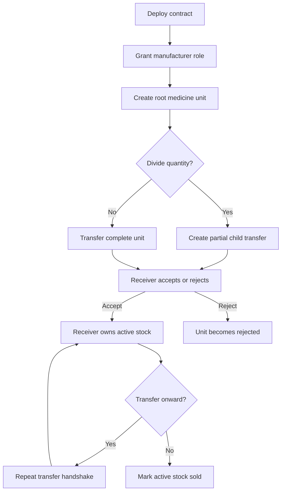
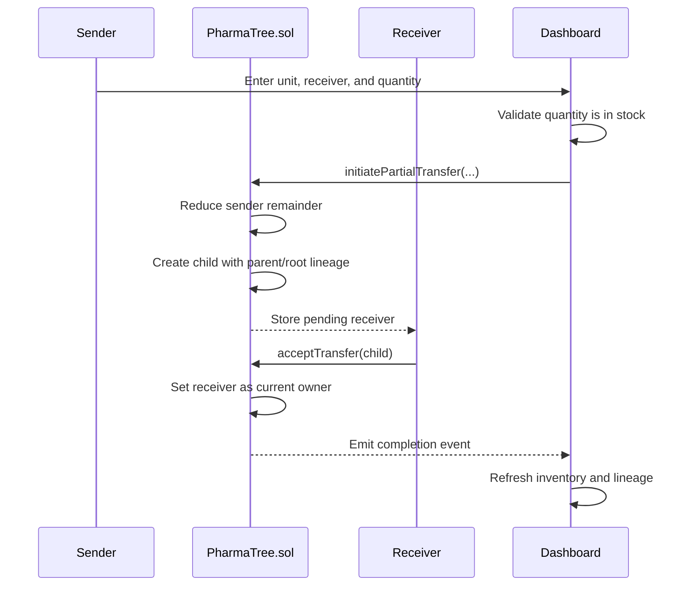
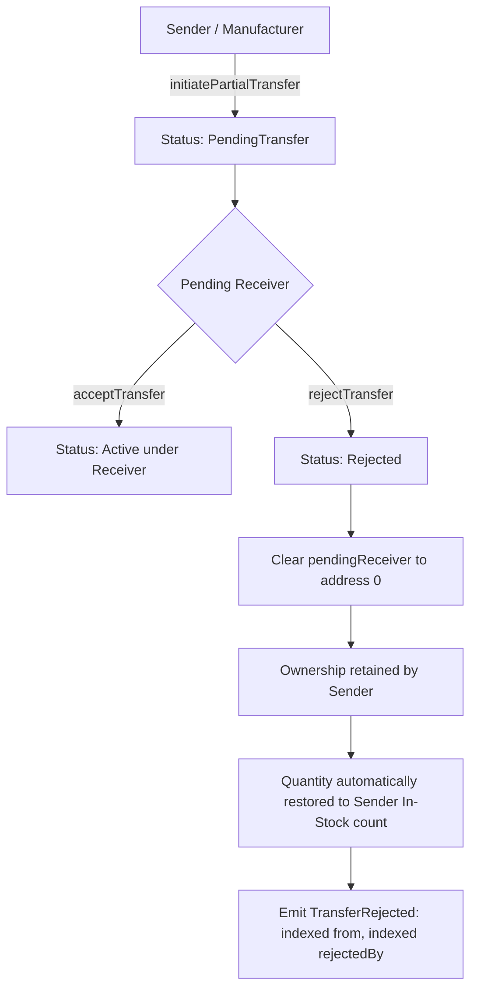
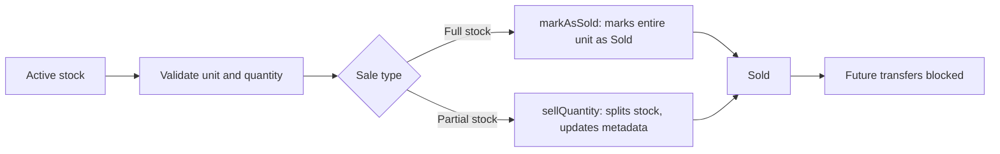

# PharmaTree project documentation

## 1. Purpose

PharmaTree is a blockchain-based pharmaceutical tracking application. It
records medicine provenance from manufacturer creation through authorized
handler transfers and final sale.

The system models a product hierarchy:

```text
Container -> Shipment -> Batch -> Box -> Individual item
```

Every unit has a numeric on-chain ID, parent/root lineage, level, manufacturer,
current owner, pending receiver, status, quantity, and metadata.

## 2. Repository structure

This repository is structured as an enterprise monorepo containing distinct `backend/` and `frontend/` workspaces:

| Path | Responsibility |
| --- | --- |
| `backend/contracts/PharmaTree.sol` | Smart contract logic: RBAC, hierarchy, ownership, transfers, partitioning, rejections, and sales |
| `backend/scripts/` | Sepolia and local Hardhat deployment, role granting, and verification workflows |
| `backend/test/PharmaTree.test.ts` | Complete Chai/Mocha smart contract unit test suite (21 test cases passing) |
| `frontend/src/app/` | Next.js 16 App Router pages (`/`, `/create`, `/admin`, `/transfers`, `/inventory`, `/verify`) |
| `frontend/src/app/verify/page.tsx` | Public medicine provenance verification & QR audit trail |
| `frontend/src/components/PharmaWalletView.tsx` | Comprehensive reactive wallet dashboard, inventory partitions, rejection UI, and transfer controls |
| `frontend/src/lib/rpc.ts` | Resilient multi-endpoint FallbackProvider with exponential backoff & rate-limit recovery |
| `frontend/src/lib/pharmaTree.ts` | Frontend ABI, contract addresses, levels, and status mappings |
| `frontend/src/lib/ipfs.ts` | Medicine metadata formatting helper |

## 3. Architecture

### System architecture

```mermaid
flowchart LR
    U[Manufacturer / Handler / Admin] --> MM[MetaMask]
    MM --> UI[Next.js 16 Dashboard]
    UI -->|Resilient Fallback Reads| RPC[Multi-Endpoint RPC Pool]
    UI -->|Signed Transactions| MM
    MM -->|Submit Tx| RPC
    RPC --> C[PharmaTree.sol (0x2bAE...044)]
    C --> S[On-chain Unit State & Partitions]
    C --> E[Immutable Audit Events]
    UI --> H[Activity & Inventory Partitions]
    UI --> M[Metadata Formatter]
    M --> C
```

### Application layers

```mermaid
flowchart TB
    Routes[Next.js App Router] --> Wallet[PharmaWalletView]
    Wallet --> Provider[Multi-Endpoint FallbackProvider (rpc.ts)]
    Wallet --> Signer[MetaMask Signer]
    Wallet --> ABI[ABI & Enum Mappings]
    Wallet --> Metadata[Metadata Helper]
    Provider --> Contract[PharmaTree.sol (0x2bAE...044)]
    Signer --> Contract
    Contract --> Roles[Access Control Matrix]
    Contract --> Units[Lineage & Stock Partitions]
    Contract --> Events[Immutable Audit Events]
```

The frontend uses a resilient multi-endpoint JSON-RPC fallback provider (`rpc.ts`) that distributes read requests across high-availability Sepolia nodes (Tenderly, PublicNode, 1RPC, Sepolia.org) with automatic backoff on HTTP 429 rate limits. MetaMask supplies the signer for state-changing operations. The smart contract remains the single source of truth for roles, ownership, hierarchy, and status.

## 4. Smart-contract model

### Roles

- **Admin:** grants and removes manufacturer and handler roles.
- **Manufacturer:** creates root medicine units and participates in transfers.
- **Handler:** receives, transfers, accepts, and rejects assigned units.
- **Current owner:** can initiate transfers, create child units where allowed,
  and mark active stock as sold.

The deploying account is initialized as admin and manufacturer.

### Unit levels

The numeric enum order used by the contract and frontend is:

| Value | Level |
| ---: | --- |
| 0 | Container |
| 1 | Shipment |
| 2 | Batch |
| 3 | Box |
| 4 | IndividualItem |

### Statuses

| Value | Status | Meaning |
| ---: | --- | --- |
| 0 | Active | Available for normal ownership operations |
| 1 | PendingTransfer | Transfer initiated and awaiting receiver action |
| 2 | Sold | Finalized and no longer transferable |
| 3 | Rejected | Pending transfer was rejected |

## 5. Application workflows

### End-to-end setup workflow



### Medicine traceability workflow



### Partial transfer and lineage workflow



### Transfer rejection & stock restoration workflow



1. **Cryptographic Protection**: Only the designated `pendingReceiver` can call `rejectTransfer(unitId)`.
2. **Immediate Custody Restitution**: On rejection, `pendingReceiver` is reset to `address(0)`, while `currentOwner` remains with the sender, preventing inventory loss.
3. **Automated Stock Restoration**: In the manufacturer/sender inventory, rejected partition quantities are automatically factored back into available inventory (`currentQuantity = activeUnits + rejectedReturnedUnits`), preventing false stock deficits.
4. **Transparent Two-Way UI Attribution**:
   - **For Rejecter Account**: Recent Activity displays a red `Rejected by You` badge, unit quantity, sender address, and rejection timestamp.
   - **For Sender Account**: Inventory partition row displays `Rejected by 0x...` directly on the tile button, status `Returned to sender`, and audit log `Transfer Rejected: 0x... ➔ Rejected by 0x...`.
   - **Public / Overview View**: Partition rows display `Rejected by 0x...` with exact retained quantities.

### QR Code Verification & Public Provenance (/verify)

PharmaTree provides an open verification portal enabling consumers, pharmacies, and regulators to verify authenticity without requiring Web3 wallets:

```mermaid
flowchart LR
    Pack[Medicine Package / Batch] --> QR[Scannable QR Code]
    QR --> Mobile[Phone camera or browser]
    Mobile --> Page[/verify?unitId=X]
    Page --> RPC[Sepolia JSON-RPC read]
    RPC --> SmartContract[PharmaTree.sol]
    SmartContract --> Audit[Authenticity Badge + Custody Timeline + Etherscan Links]
```

1. **In-Dashboard QR Generation**: Handlers and manufacturers can click **View Public QR Code** on any inventory item or modal to generate, copy, or download a printable high-resolution PNG QR label.
2. **Public Provenance Audit**: Scanning the QR code opens `/verify?unitId=X`, displaying the authenticity status, verified manufacturer wallet, container level, and an immutable chronological custody audit trail with direct links to Sepolia Etherscan.
3. **Manual Unit Search**: Allows manual lookups for any unit ID directly from the verification interface.

### Sale workflow



PharmaTree supports both full and partial quantity sales:
1. **Partial sales (`sellQuantity`)**: The seller can sell any integer quantity $\le$ available stock. The contract creates a new child unit for the sold portion marked as `Sold`, decrements the seller's remaining inventory, and dynamically synchronizes metadata on-chain for both units (e.g. `Paracetamol, 30 tablets`).
2. **Full sales (`markAsSold`)**: Direct sell method that marks the entire unit quantity as `Sold`.
3. The inventory and partition views track partial sales with a dedicated `Partially sold` status badge and display exact sold/active quantity tallies.
4. **Owned inventory detachment**: Sold units (`Status.Sold`) are detached from on-hand owned inventory and total stock volume calculations across dashboard and handler inventory views, ensuring on-hand volume reflects only active and custody-held units.

### Create medicine

An authorized manufacturer or admin creates a root unit with a level, metadata,
and positive quantity. The frontend validates wallet connection, role, name,
and quantity before submitting the transaction.

### Partial transfer

The current owner can transfer all or part of an active unit's quantity to an
authorized receiver. A partial transfer:

1. Validates that the quantity is positive and in stock.
2. Keeps the remainder on the sender's unit.
3. Creates a child transfer unit for the quantity being sent.
4. Records the pending receiver.
5. Requires the receiver to accept or reject the transfer.

Manufacturer views preserve lineage labels such as `1.1`. Handler inventory
uses wallet-local numbering such as `1` and `2`, so units received from
different senders are not incorrectly grouped together.

### Transfer acceptance/rejection

The receiver must be authorized and must match the pending receiver stored on
the unit. Acceptance changes ownership and returns the unit to `Active`.
Rejection clears the pending receiver and sets the unit to `Rejected`.

### Sale & Retail Dispensing

The current owner can mark an active unit as sold either completely (`markAsSold`)
or partially (`sellQuantity`). Partial dispensing splits the stock into an active remainder
and a detached sold child unit with synchronized metadata. Sold units cannot be
transferred or sold again and are detached from on-hand owned inventory tallies.

### Role administration

The admin view grants manufacturer and handler roles. The dashboard prevents
non-admin users from granting manufacturer roles and checks receiver
authorization before transfer submission.

## 6. Frontend routes

All routes render the reusable `PharmaWalletView` component with a different
view mode:

| Route | Purpose |
| --- | --- |
| `/` | Overview, status summaries, reactive stock charts, and recent activity |
| `/create` | Create root medicine units (Authorized Manufacturers only) |
| `/admin` | Grant manufacturer and handler roles (Admin only) |
| `/transfers` | Initiate, accept, reject, and review transfers |
| `/inventory` | View owned stock, lineage, partitions, quantity, and rejection status |
| `/verify` | Public consumer provenance verification and QR code audit trail |

The dashboard distinguishes manufacturer-created medicines from handler
inventory. Manufacturer tables preserve creation and lineage context; handler
tables focus on current stock and transfer status.

## 7. Environment configuration

Create local files from the committed templates:

```bash
cp .env.example .env
cp .env.local.example .env.local
```

`.env.example` contains deployment variables such as:

- `RPC_URL` and `PRIVATE_KEY` for local scripts.
- `SEPOLIA_RPC_URL` and `SEPOLIA_PRIVATE_KEY_MANUFACTURER` for Sepolia.
- Optional distributor/manufacturer addresses and keys.
- `ETHERSCAN_API_KEY` for verification.

`.env.local.example` contains browser configuration:

```dotenv
NEXT_PUBLIC_RPC_URL=http://127.0.0.1:8545
NEXT_PUBLIC_CHAIN_ID=31337
NEXT_PUBLIC_PHARMA_TREE_CONTRACT=0xYOUR_DEPLOYED_CONTRACT_ADDRESS
NEXT_PUBLIC_DEPLOYMENT_BLOCK=
NEXT_PUBLIC_PINATA_API_KEY=
NEXT_PUBLIC_PINATA_SECRET_API_KEY=
```

Use chain ID `11155111` and the Sepolia RPC URL for Sepolia. Never commit
`.env`, `.env.local`, private keys, API keys, or real RPC project IDs.

## 8. Local development

From the repository root:

```bash
npm install
npm run compile
npm test
```

Start the local chain:

```bash
npm run node
```

In another terminal, deploy the contract:

```bash
npx hardhat run scripts/deploy.ts --network localhost
```

Set the printed address in `.env.local`, connect MetaMask to
`http://127.0.0.1:8545` with chain ID `31337`, import a funded Hardhat account,
and start the dashboard:

```bash
npm run dev
```

Open <http://localhost:3000>.

## 9. Sepolia deployment

After filling the required values in `.env`:

```bash
npm run deploy:sepolia
npm run deploy:fresh-manufacturer
npm run verify:sepolia
npm run verify:sepolia-two-wallet
```

The fresh manufacturer script deploys a new contract, assigns the manufacturer
role, and updates the local contract address/deployment block configuration.
Use a dedicated Sepolia test wallet with no real funds.

## 10. Validation

Automated checks:

```bash
npm run compile
npm test
npm run lint
npm run build
```

The contract suite covers:

- Admin and role authorization.
- Root and child unit creation.
- Partial quantity transfers.
- Parent/child packing authorization.
- Transfer acceptance and rejection.
- Ownership changes.
- Sale detachment and transfer prevention.

Manual dashboard checks:

1. Connect a manufacturer wallet.
2. Create medicine and confirm it appears in Overview and Inventory.
3. Grant a handler role.
4. Transfer a full quantity and accept it from the handler wallet.
5. Transfer a partial quantity and verify the sender remainder.
6. Confirm handler inventory uses separate local unit numbers.
7. Try an unauthorized receiver and an over-quantity transfer.
8. Sell active stock and confirm it cannot be transferred afterward.

## 11. Known limitations & future roadmap

- `frontend/src/lib/ipfs.ts` formats metadata locally; production decentralized pinning can be integrated with server-side Pinata/IPFS API endpoints.
- Unit reads iterate through the contract's unit counter with cached log enrichment. In enterprise high-volume settings, an indexing subgraph (The Graph) or indexed event cache would scale querying.
- Contract addresses and network settings are supplied through environment variables and validated against the connected MetaMask network.

## 12. Security and public release

- Keep all secrets in ignored local environment files (`.env`, `.env.local`).
- Use placeholder values in committed templates (`.env.example`, `.env.local.example`).
- Do not expose private keys in scripts, screenshots, logs, issues, or commits.
- Use a dedicated test wallet for local and Sepolia automation.
- Rotate any credential that may have been exposed.

## 13. Author and project links

**Ayon Moitra**

- GitHub: [@ayonm95](https://github.com/ayonm95)
- Repositories:
  - [Pharma (Monorepo)](https://github.com/ayonm95/Pharma)
  - [pharmatree (Public Mirror)](https://github.com/ayonm95/pharmatree)
- LinkedIn: [Ayon Moitra](https://www.linkedin.com/in/ayon-moitra/)

This project is distributed under the [MIT License](./LICENSE).
