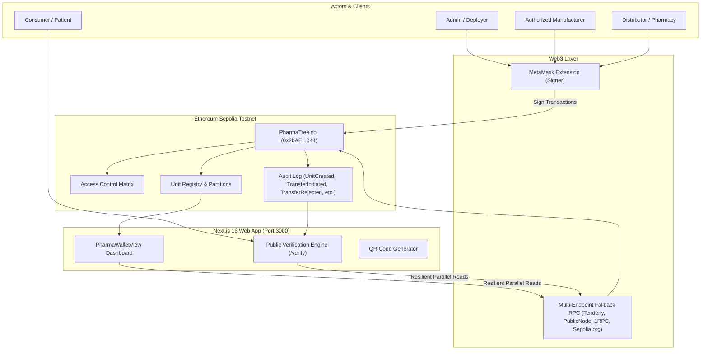

# PharmaTree ✚
### Immutable Blockchain-Based Pharmaceutical Supply Chain Tracking & Verification Engine

[](https://soliditylang.org/)
[](https://sepolia.etherscan.io/)
[](https://nextjs.org/)
[](https://docs.ethers.org/)
[](LICENSE)

PharmaTree is an enterprise-grade decentralized pharmaceutical supply chain tracking platform designed to eliminate counterfeit medicines, secure chain of custody, and provide instant consumer authenticity verification through cryptographic proof on the Ethereum blockchain.

---

## 🌟 Key Capabilities

- **Role-Based Access Control (RBAC)**: Enforces on-chain cryptographic authorization for **Admin**, **Manufacturer**, and **Handler** (Distributor, Wholesaler, Hospital, Pharmacy) roles.
- **Hierarchical Packaging Lineage**: Tracks medicines across 5 distinct supply chain tiers:
  $$\text{Container} \longrightarrow \text{Shipment} \longrightarrow \text{Batch} \longrightarrow \text{Box} \longrightarrow \text{Individual Item}$$
- **Two-Party Custody Handshake & Explicit Rejection Flow**: Prevents inventory interception or unilateral dumping. Inbound shipments require explicit mutual acceptance by the authorized recipient. Receivers can reject suspicious or damaged shipments, automatically returning stock to the sender's inventory while recording a transparent on-chain audit trail (`Rejected by 0x...`).
- **Inventory Partitioning & Detachment**: Supports partial transfers (`initiatePartialTransfer`) and partial retail dispensing (`sellQuantity`), preserving sender remainder while detaching new child units.
- **Consumer Verification & QR Audit Trail**: Dedicated public verification portal (`/verify`) allowing anyone to scan a QR code or search a Unit ID to inspect the full chronological chain of custody without needing a crypto wallet.
- **Resilient Multi-Endpoint Fallback RPC**: Built-in RPC failover engine (`rpc.ts`) with exponential backoff and rate-limit recovery across public Sepolia providers.
- **Real-Time Next.js 16 Web Dashboard**: Responsive UI with automated MetaMask account detection, reactive donut stock charts, and dynamic role panels.

---

## 🏛️ System Architecture



---

## 📍 Live Deployment (Ethereum Sepolia)

| Parameter | Value |
| :--- | :--- |
| **Network** | Ethereum Sepolia Testnet |
| **Chain ID** | `11155111` |
| **Contract Address** | [`0x2bAE15834463a657F68673135B8deCd39EF33044`](https://sepolia.etherscan.io/address/0x2bAE15834463a657F68673135B8deCd39EF33044) |
| **Deployment Block** | `11683269` |
| **Solidity Compiler** | `v0.8.20+commit.a1b79de6` |

### Default Test Wallets

| Role | Address | Description |
| :--- | :--- | :--- |
| **Admin & Manufacturer** | `0x65371f0ddFa0AD6e7655243cD2A2567328EA1537` | Deploys contracts, mints batches, grants roles |
| **Distributor / Handler** | `0x1589df48e9F04926E260Bf813c42dFb4a71893A3` | Authorized handler for custody transfer & dispensing |
| **Secondary Handler** | `0xe88a5608B536BCc9d557823234BacA9a00F2540B` | Secondary authorized handler |

---

## 📁 Repository Structure

```text
.
├── backend/                  # Smart contract development & Hardhat environment
│   ├── contracts/            # Solidity smart contracts (PharmaTree.sol)
│   ├── test/                 # Chai/Mocha smart contract unit test suite
│   ├── scripts/              # Deployment, role granting & verification scripts
│   └── hardhat.config.ts     # Hardhat network & compiler configuration
│
├── frontend/                 # Next.js 16 Web Application (App Router)
│   ├── src/app/              # Next.js routes (overview, create, transfers, inventory, verify)
│   ├── src/components/       # Modular UI components (PharmaWalletView, StockDonutChart)
│   ├── src/lib/              # ABI definitions, ethers provider helpers, IPFS tools
│   └── public/               # Static assets & SVG icons
│
├── .github/workflows/        # Automated CI/CD pipelines
├── package.json              # Root-level unified execution scripts
├── PROJECT_DOCUMENTATION.md  # Detailed technical specifications & data models
└── README.md                 # Primary project overview
```

---

## 🚀 Quick Start

### Prerequisites
- [Node.js](https://nodejs.org/) (v18 or v20+)
- [MetaMask](https://metamask.io/) browser extension configured for Sepolia testnet

### 1. Installation

Install dependencies for both backend and frontend:

```bash
# Install backend dependencies
cd backend && npm install && cd ..

# Install frontend dependencies
cd frontend && npm install && cd ..
```

### 2. Configure Environment Variables

Create `.env` in `backend/` and `.env.local` in `frontend/` (or copy from examples):

**`backend/.env`**:
```env
SEPOLIA_RPC_URL=https://ethereum-sepolia-rpc.publicnode.com
SEPOLIA_PRIVATE_KEY_MANUFACTURER=0x...
SEPOLIA_PRIVATE_KEY_DISTRIBUTOR=0x...
SEPOLIA_CHAIN_ID=11155111
ETHERSCAN_API_KEY=<YOUR_ETHERSCAN_KEY>
SEPOLIA_CONTRACT_ADDRESS=0x2bAE15834463a657F68673135B8deCd39EF33044
```

**`frontend/.env.local`**:
```env
NEXT_PUBLIC_PHARMA_TREE_CONTRACT=0x2bAE15834463a657F68673135B8deCd39EF33044
NEXT_PUBLIC_RPC_URL=https://ethereum-sepolia-rpc.publicnode.com
NEXT_PUBLIC_CHAIN_ID=11155111
NEXT_PUBLIC_DEPLOYMENT_BLOCK=11683269
```

### 3. Run Development Server

From the root directory:

```bash
npm run dev
```

Open [http://localhost:3000](http://localhost:3000) in your browser.

---

## 🧪 Testing & Validation

Run the complete smart contract test suite covering all 21 verification scenarios:

```bash
# Run smart contract unit tests from root
npm test

# Run tests and validate frontend production build
npm run test:all
```

Test coverage includes:
- Role assignment and permission denial
- Hierarchical unit creation and owner permissions
- Two-party transfer handshake (initiate, accept, reject)
- Receiver authorization verification
- Partial unit quantity splitting (`initiatePartialTransfer`)
- Partial dispensing (`sellQuantity`) and complete unit sale detachment

---

## 📦 Deployment & Verification Workflows

To deploy a fresh instance of the smart contract to Sepolia and automatically update all frontend and backend configuration files:

```bash
npm run deploy:sepolia
```

To grant roles to the distributor account on Sepolia:

```bash
npm --prefix backend run hardhat run --network sepolia scripts/grant-roles.ts
```
One click contract address update and maufacturer to default depoloyer account

```bash
npx hardhat run scripts/deploy-and-sync-env.ts --network sepolia
```


---

## 📜 License

This project is licensed under the MIT License.
